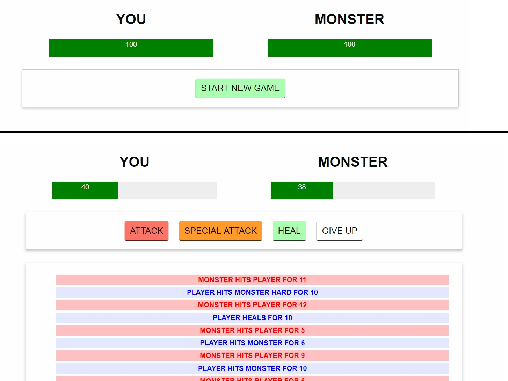

# VueJS-turnBasedGame
Simple turn based game made with vuejs.   
The player can attack the monster that will in turn launch an attack (both will do random damage).   
By launching a special attack the player will always win against the monster.    
The player can also choose not to attack and heal or if he thinks that he has lost, surrender.

HTML, CSS, VueJS.

***
### [Live Website](https://gianluigivitale.github.io/vuejs-turnBasedGame/)
***
### Preview:

